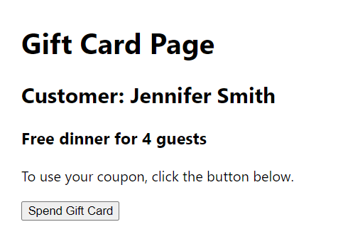

In this app I put some exercises and examples which are part of Week 2 "React Hooks and Custom Hooks"(Meta's Advanced React)
1. The correct way to update the state object in React when using useState. (./components/Objects.js)
This usually involves using the spread operator (...).
2. Using the tate hook with an object(./component/Goals.js)
3. Exercise: Managing state within a component(./GiftCards.js)
