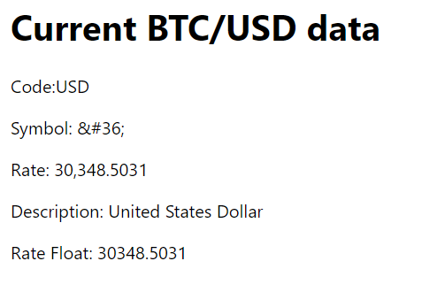
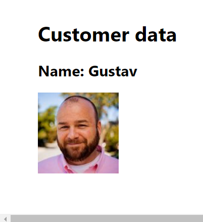

In this app I put some exercises and examples which are part of Week 2 "React Hooks and Custom Hooks"(Meta's Advanced React)
1. useState (Object.js)

2. The correct way to update the state object in React when using useState. (./components/Objects.js)
This usually involves using the spread operator (...).

3. Using the tate hook with an object(./component/Goals.js)

4. Exercise: Managing state within a component(./GiftCards.js)

5. Updating nested objects (./components/Artwork.js);

6. useEffect component which is fetching data (./components/Bitcoin.js)

7. A practice fetching some data from the randomuser.me website's API(CustomerData.js).

8. useReducer implementation for keep track on expences and income in the Little Lemon restaurant(Track.js)

9. useReducer component named Form is created(Form.js)

After you type name "Teodor" and click on the button 4 times:

10. "Prague intinerary" is created with useReducer(TaskAppReducer.js) 

11. Fatching a video player (VideoPlayer.js) 
