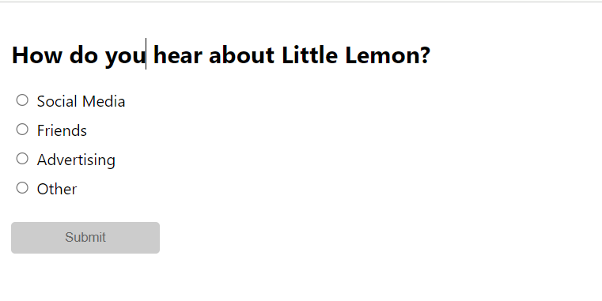
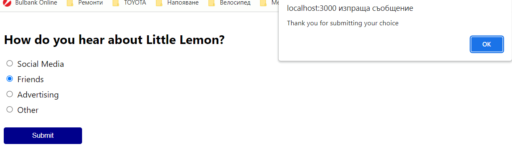
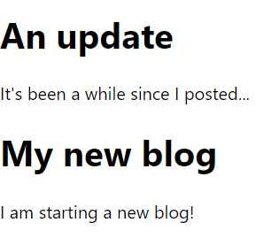
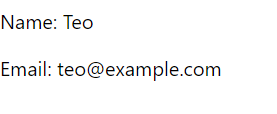

This is my work during week 3 "JSX and testing" of Meta course "Advanced React".

1. Build a Radio Group Component (.Radio/index.js and .Radio/styles.css)

2. An example of how to use Fragment (Blog.js)

3. A simple HOC is created(User.js and withLoader.js)
