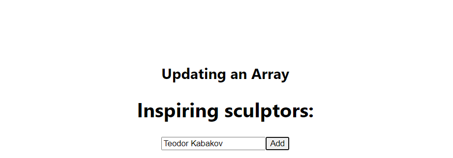

# React State codes

1. Fix incorrect state updates (Scoreboard.js)
2. An example of "deep" state update on second level (Canvas.js, Box.js and Background.js)
3. Uppdateing an array using spread[...] sintax. (UpdatingArray.js)
4.