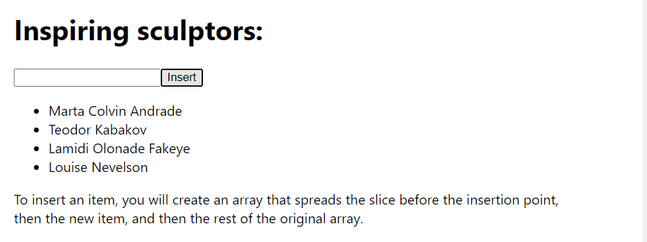
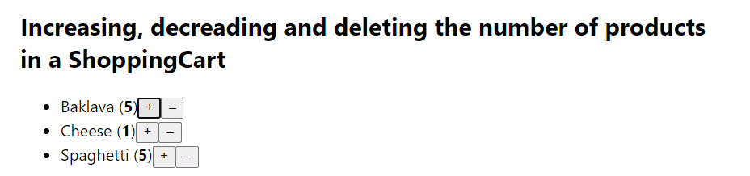

# React State codes

1. Fix incorrect state updates (Scoreboard.js)
2. An example of "deep" state update on second level (Canvas.js, Box.js and Background.js)
3. Uppdateing an array using spread[...] sintax. (UpdatingArray.js)
4. Deleting items from an array by the use of filter()(RemovingArray.js).
5. Inserting items into an array using the slice().[Alt text](image-10.png)
6. Replacing items from an array with map() and item index as second arrgument.
7. You can transform(change) an array with map().
8. Updating Objects inside an Array(ObjectInsideArray.js)
9. Update an item in the shopping cart (ShoppingCart.js)
10. Updating the number of the items in a Shopping cart (ShoppingCart.js)
    -increading
    -decreasing
    -deleting
    
