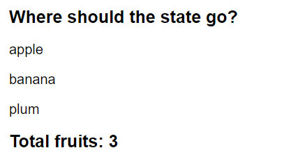

# Few examples of passing propps

1. Passing props and rendering list using map.(Fruits.js)
2. Simple example of passing props (Heading.js)
3. Passing props for a profile discription (Profile.js)!
4. Having conditilal size of the image (Avatar.js)
