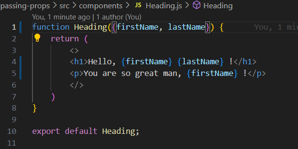

# Few examples of passing propps

1. Passing props and rendering list using map.(Fruits.js)
2. Passing an array in props and calculating its length.(FruitsCounter.js)
3. Using props in curly brackets
4. Simple example of passing props (Heading.js)
5. Passing props for a profile discription (Profile.js)!
6. Having conditilal size of the image (Avatar.js)
