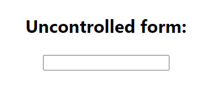
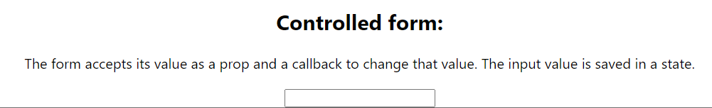
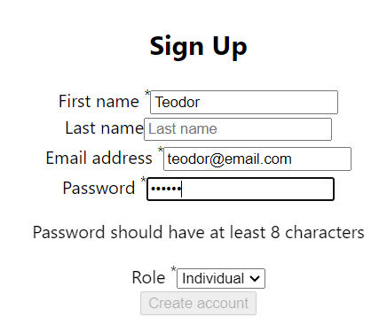
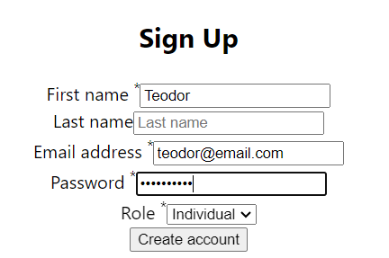

This app demonstrate some features of Forms in React.
1. Useage of uncontrolled forms with useRef (From.js).
2. Controlled form - the form accepts its value as a prop and a callback to change that value. The input value is saved as a state (FromControlled.js).
3. A Feadbackform with a range and a textarea inputs. There is also a submit button and a condition for submittion for both range and textarea.
4. More compihended form which includes: first name, last name, email, passward and role(RegForm). For all inputs there is a validation check in getIsFornValid function. There is an external email validation component (utils.js). Submit button is disabled.
5. Form2.js has following features: 
    -text input;
    -checkbox input;
    -radio input;
    -initial values by defaultValue and defaultChecked;
    -usedId hook for ID and htmlFor;