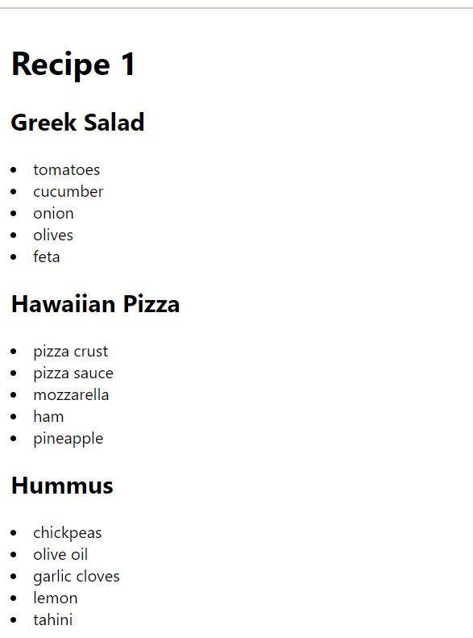
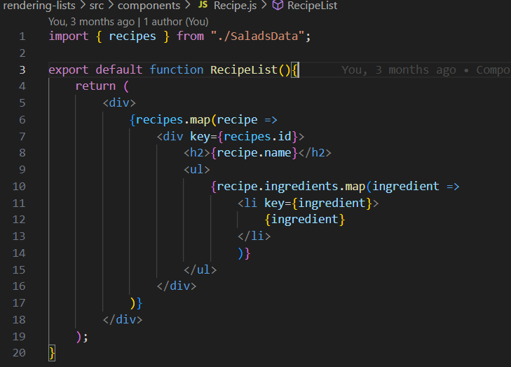
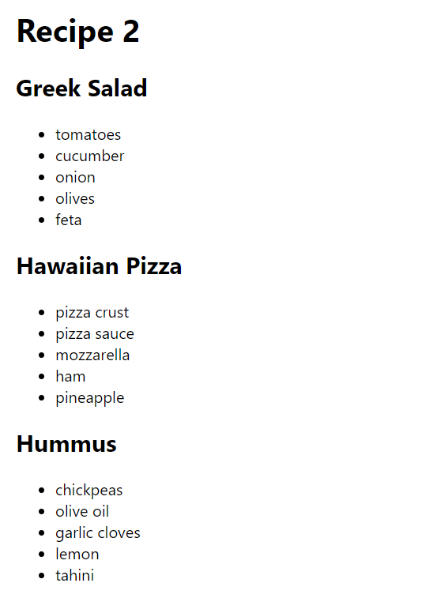
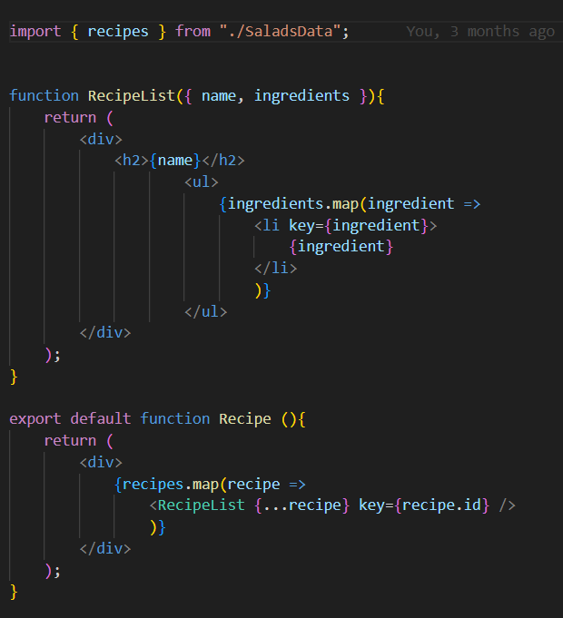

1. Nested map arrow functions of an array, rendering list os names and ingradients of recipe(Recipe.js)

2. The same list is rendered, but the outer map is copy-paste into a new Recipe component and return that JSX.(Recipe2.js)
