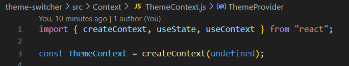
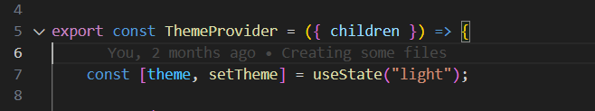

 One of the most common use cases for Context is to define a theme for your application. In this exercise, you created a light-dark theme switcher.
 Step 1. A new context object is created using createContext:
 
 Step 2. A new piece of local state is defined (inside ThemeProvider):
 
 Step 3. The ThemeCOntext.Provider render and wrap the children it the return statement:
 