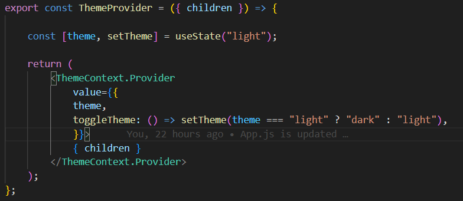
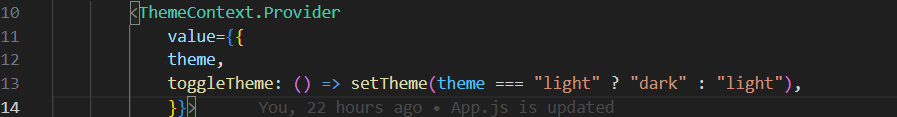
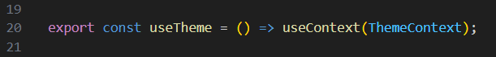
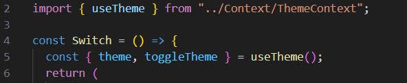
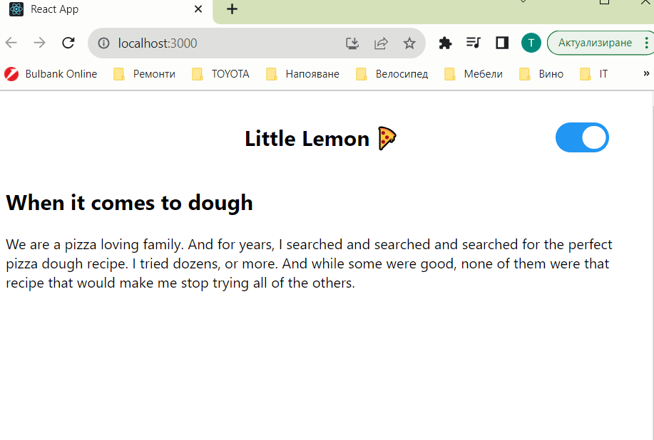

 One of the most common use cases for Context is to define a theme for your application. In this exercise, you created a light-dark theme switcher.
 Step 1. A new context object is created using createContext:
 
 Step 2. A new piece of local state is defined (inside ThemeProvider):
 
 Step 3. The ThemeCOntext.Provider render and wrap the children it the return statement:
 
 Step 4. The value prop object of ThemeContext.Provider is recalled with two values - theme and toggleTheme. theme is the ligth-dark string value, whereas toggleTheme is a function that toggles the theme from ligth to dark and vise versa:
 
 Step 5. The useContext created a custom hook named useTheme:
 
 Step 6. To implement the useTheme custon hood, it is imported and destructed:
 
 This is how the page looks the light mode:
 
 and this is in the dark mode:
 